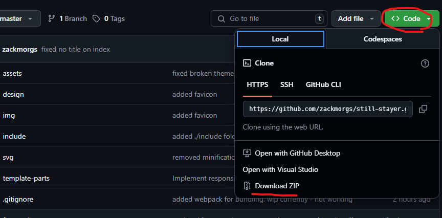

# still-stayer
My go at a wordpress theme for the band [Still Stayer](https://facebook.com/stillstayer).

## Instructions for Client

1. Download the repo as a .zip via the above screenshot.

2. Place it in the themes folder
    - `/wp-content/themes/`
3. Create the following pages using wordpress. Just give them a title for now. 
    - Listen
        - Not content editable.
    - Shows
    - Merch
    - Gallery
    - Blog
    - Contact
        - Not content editable.

4. Settings > Reading 
    - Homepage: "Home"
    - Posts Page: "Blog"
5. Create your blog posts and add content to pages. (Unless content is not editable on page)
6. Done ✔️

